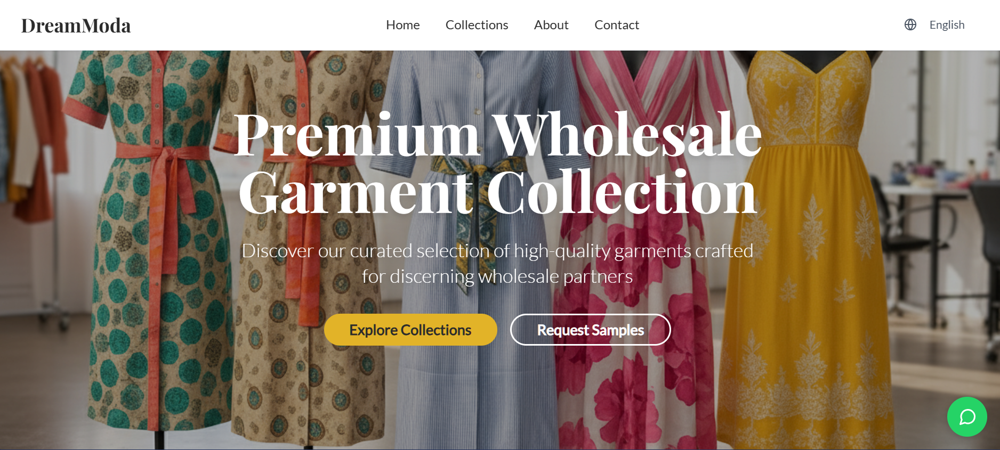
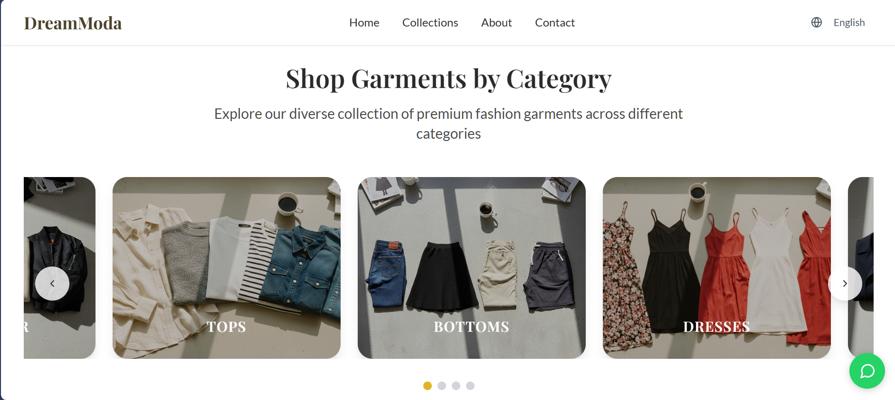
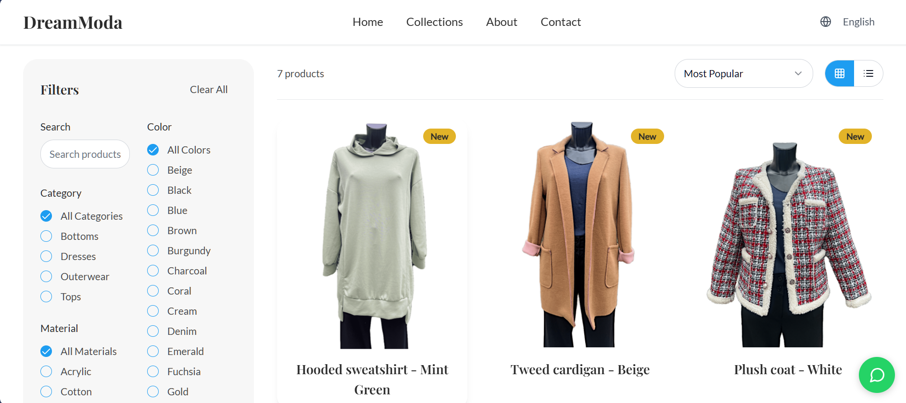
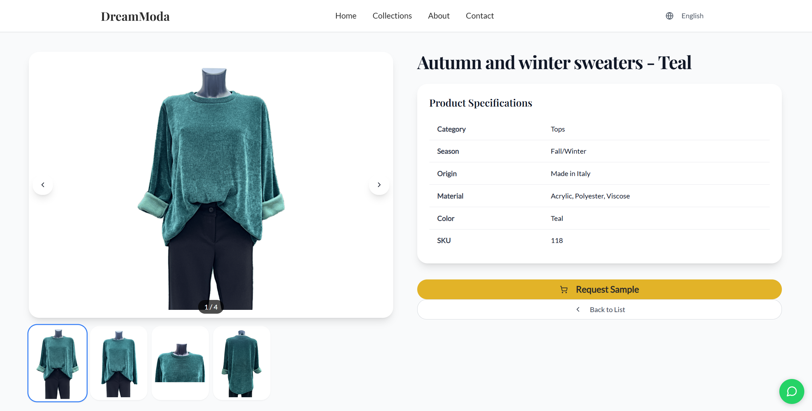
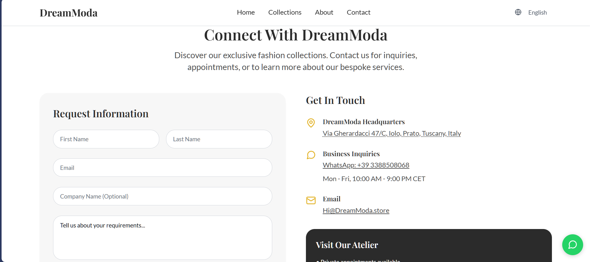
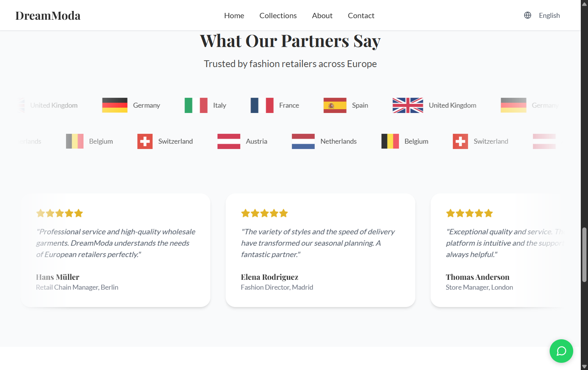
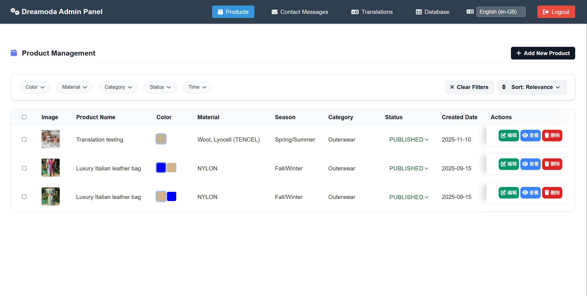
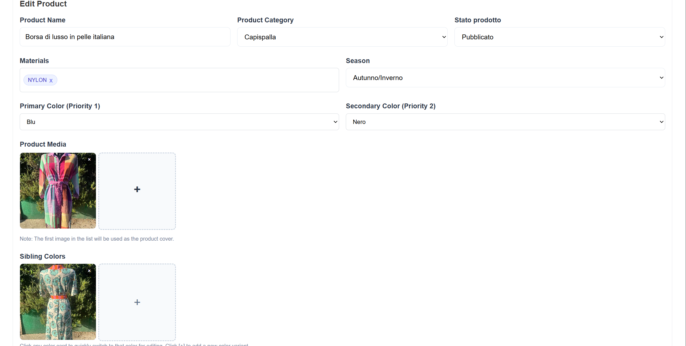
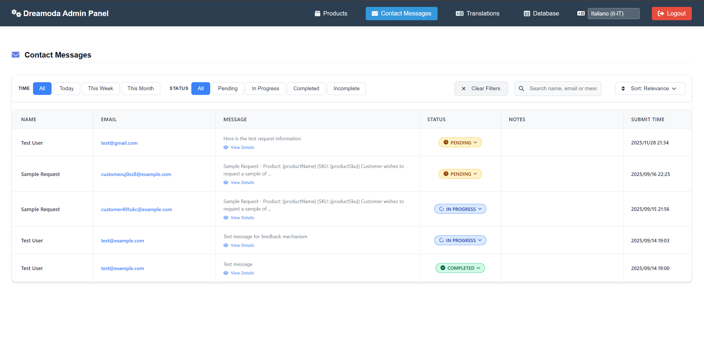
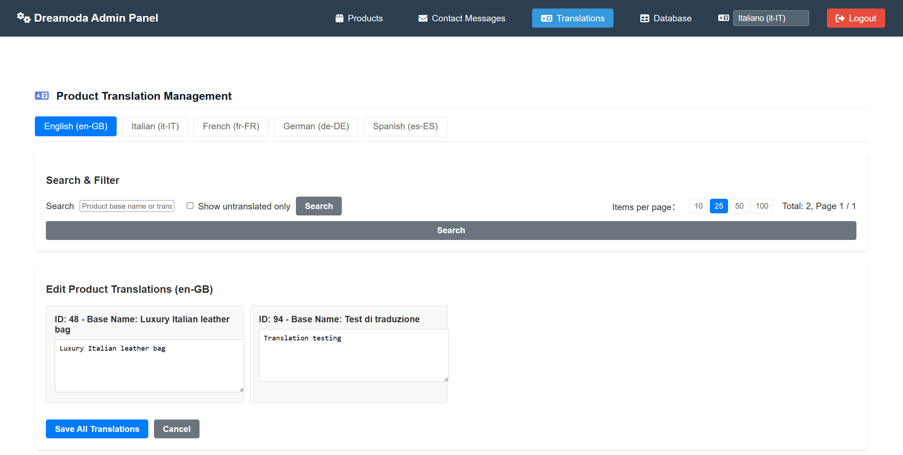

# Dreamoda B2B Showcase Platform

<p align="center"><a href="README.md">English</a> | <a href="README_cn.md">中文</a></p>

Dreamoda is a B2B product showcase and inquiry platform for garment manufacturers. It provides a multi‑language product catalog, responsive storefront, and modular admin console for products, media, translations, inquiries, users, and security. This repository is a demo implementation; this document focuses on a concise feature overview and key UI screenshots.

## Table of Contents
- [Product Highlights](#product-highlights)
- [Architecture](#architecture)
- [Core Features](#core-features)
- [UI Gallery](#ui-gallery)
- [Project Structure](#project-structure)
- [Admin Modules](#admin-modules)
- [API Overview](#api-overview)
- [Related Docs](#related-docs)
- [License](#license)

## Product Highlights
- **Storefront**: React + TypeScript SPU/SKU product catalog with color variants, related items, and smart filtering.
- **Admin console**: PHP 8 modular back office covering products, master data, media, inquiries, translations, user access, and logs.
- **Internationalization**: 6 built‑in languages (zh/en/de/fr/it/es), shared language constants and types, Microsoft Translator integration, and translation logs.
- **Security**: Session‑based auth with TOTP 2FA, centralized security helpers, and unified error logging.
- **End‑to‑end demo**: Complete flow from browsing and filtering, to inquiry submission, to back‑office review and multi‑language display.

## Architecture
```
┌─────────────────┐    ┌─────────────────┐    ┌─────────────────┐
│    Frontend     │    │     Backend     │    │      Shared     │
│  (React + Vite) │◄──►│   (PHP + API)   │◄──►│ (Types & Schema)│
└─────────────────┘    └─────────────────┘    └─────────────────┘
```
- **Modern frontend**: React 18, TypeScript, Tailwind CSS, Radix UI, TanStack React Query, Wouter routing.
- **Modular backend**: PHP 8 RESTful API with componentized admin UI, event‑driven JS, and centralized security/database layers.
- **Shared layer**: Single‑source‑of‑truth TypeScript types, Zod validation, language constants, and database schema shared across frontend and backend.

## Core Features
### Frontend (React + TypeScript)
- SPU/SKU catalog: products grouped by SPU with color‑based SKUs, related products, and image gallery on detail pages.
- Advanced filtering & search: by category, material, color, season, and multi‑language keywords, with grid/list switcher and paginated skeleton states.
- Marketing home & landing sections: hero banner, brand story, custom services, and partner/testimonial sections.
- Contact & inquiry: multi‑language contact/inquiry form using React Hook Form + Zod with real‑time validation and clear submit feedback.
- i18n & SEO: 6‑language switcher, SEO meta tags, structured data, image lazy loading, and responsive layout.

### Admin (PHP)
- Product management: SPU/SKU create & edit flows, media upload and ordering, status management, and multilingual fields.
- Master data editing: categories, colors, materials, and seasons with per‑language values, language switcher, and creation status hints.
- Inquiries & contact: contact/inquiry message list with date/status filters, notes, sorting, and mobile‑friendly layout.
- Translation console: paginated translation list, per‑product editing, “missing only” filters, and translation logging.
- Auth & security: session‑based login, TOTP 2FA, session checks, and shared security helpers for input sanitization and prepared statements.

### APIs & Integration (PHP REST)
- Products & master data: `/backend/api/products.php`, `/backend/api/categories.php`, `/backend/api/colors.php`, `/backend/api/materials.php`, `/backend/api/seasons.php`.
- i18n & config: `/backend/api/translation.php`, `/backend/api/language.php`, `/backend/api/config.php`.
- Media & contact: `/backend/api/media.php`, `/backend/api/contact.php`, `/backend/api/contact_messages.php`, `/backend/api/inquiries.php`.
- Admin & security: `/backend/api/admin/*.php` (master data and translation logs), `/backend/api/login.php`, `/backend/api/logout.php`, `/backend/api/check_session.php`, `/backend/api/verify_2fa.php`.

### Shared Layer & Operations
- Shared types & constants: `shared/types`, `shared/constants`, and `shared/database/schema.ts` used by both frontend and backend.
- Utilities & translation gateway: `shared/utils` plus `backend/lib/translation_gateway.php` for consistent translation and error structures.
- Logging & monitoring: `translation_logs` table for auto/manual translations and `storage/logs/php_errors.log` for runtime errors.
- Deployment: `scripts/deploy.bat` encapsulates build, sync, and health checks.

## UI Gallery

### Frontend
| Scenario (Live URL) | Preview | Highlights |
| --- | --- | --- |
| [Home](https://dreamoda.store/en/#hero) |  | Hero banner, category carousel, featured products, brand story, custom services, partners and testimonials, with a contact form anchor. |
| [Home category focus](https://dreamoda.store/en/#category) |  | Category carousel with six collections, scrollable navigation and deep links into filtered collections for large SKU sets. |
| [Collections & filters](https://dreamoda.store/en/collections) |  | React Query powered list with multi‑language filters (category/material/color/season), search, sort, grid/list toggle, and skeleton loading states. |
| [Product detail](https://dreamoda.store/en/product/118) |  | Image gallery, material/color/spec information, related products, and multi‑language SEO metadata. |
| [Contact & inquiry](https://dreamoda.store/en/#contact) |  | React Hook Form + Zod validation, toast feedback, Google Maps link, and localized helper texts. |
| [Partners & testimonials](https://dreamoda.store/en/#partners) |  | Scrolling country flags and testimonial carousel showcasing European B2B trust and feedback. |

### Admin
| Scenario | Preview | Highlights |
| --- | --- | --- |
| Product dashboard |  | Bulk filtering/sorting, row selection, quick navigation to create/edit, language switcher, and batch status management. |
| Product form |  | Validated form with material/color/season selectors, media upload with ordering, toasts, and reusable `_form.php` component. |
| Inquiry management |  | Inquiry list and detail view with time/status filters, notes, sorting, and “No data” fallback. |
| Translation management |  | Language tabs, pagination, missing‑only filters, per‑product field editing, and batched saves. |

## Project Structure
```
Dreamoda/
├── frontend/        # React + Vite frontend
│   ├── src/         # Source and UI components
│   ├── public/      # Static assets and locale JSON
│   └── *.config.ts  # Frontend config
├── backend/         # PHP API and admin
│   ├── api/         # RESTful API endpoints
│   ├── admin/       # Admin pages
│   └── config/      # Environment and DB config
├── shared/          # Types, constants, utilities, DB schema
├── docs/            # Architecture and technical docs
├── scripts/         # Deployment and tooling scripts
├── storage/         # Media, uploads, and logs
└── package.json     # Root scripts and dependencies
```

## Admin Modules
- **Product management** (`/backend/admin/dashboard.php`): list, filter, sort, bulk actions, and navigation to create/edit products.
- **Product create/edit** (`/backend/admin/add_product.php`, `/backend/admin/edit_product.php`): structured forms, media upload, material/color/season metadata, and language tabs.
- **Master data editing** (`/backend/admin/data-editing.php`): multi‑language categories, colors, materials, and seasons with language picker and creation state hints.
- **Inquiries** (`/backend/admin/contact_messages.php`): inquiry/contact lists with status flags, notes, and mobile‑friendly layout.
- **Translations** (`/backend/admin/translations.php`): language switcher, pagination, empty‑value filters, and per‑field editing wired to translation logs.
- **Authentication** (`/backend/admin/login.html`): login form + session checks, backed by `/backend/api/verify_2fa.php` for TOTP verification.
- **Technical architecture**: componentized JS, event bus patterns, responsive UI, toast notifications, and dual‑side validation.

## API Overview
- **Products & master data**: `/backend/api/products.php`, `/backend/api/categories.php`, `/backend/api/colors.php`, `/backend/api/materials.php`, `/backend/api/seasons.php`
- **i18n & config**: `/backend/api/translation.php`, `/backend/api/language.php`, `/backend/api/config.php`
- **Media & contact**: `/backend/api/media.php`, `/backend/api/contact.php`, `/backend/api/contact_messages.php`, `/backend/api/inquiries.php`
- **Admin & security**: `/backend/api/admin/*.php`, `/backend/api/login.php`, `/backend/api/logout.php`, `/backend/api/check_session.php`, `/backend/api/verify_2fa.php`

## Related Docs

- [Architecture and technical details](architecture.md)
- [API Specification](api_specification.md)

## License
This project is designed for Dreamoda commercial use.

