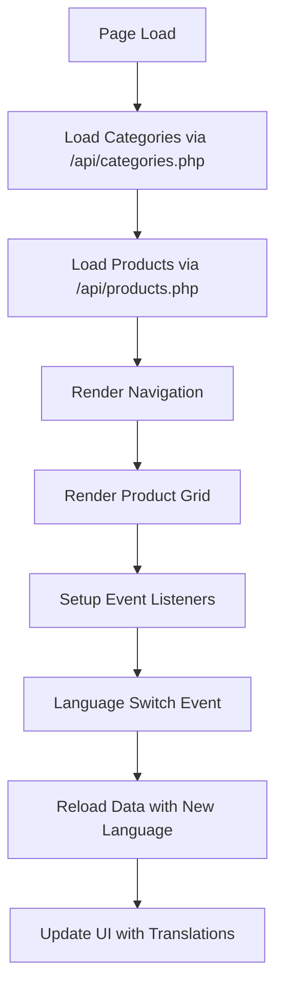
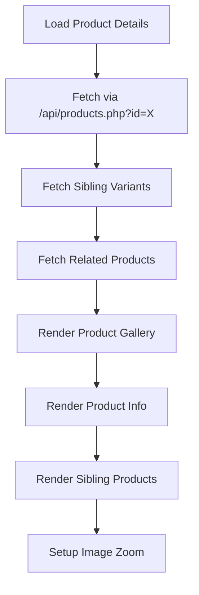
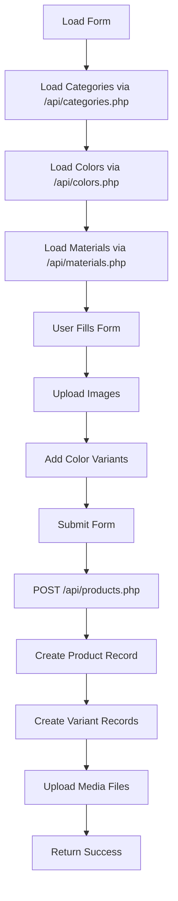
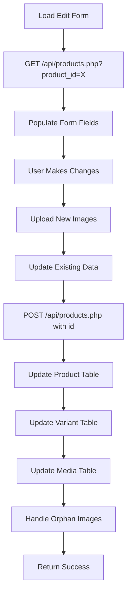

# DreaModa Product Showcase Project

## Overview
This is a B2B product showcase website for a fashion collection, featuring a multi-language frontend, comprehensive admin panel, and RESTful API backend. The project follows modern web development practices with PHP backend, vanilla JavaScript frontend, and MySQL database.

## Database Schema

### Core Tables

#### `product`
- **Purpose**: Stores base product information
- **Key Fields**:
  - `id` (PK): Unique product identifier
  - `base_name`: Product base name (without color)
  - `description`: Product description
  - `category_id`: Foreign key to category table
  - `status`: Product status ('published', 'draft', etc.)
  - `created_at`: Creation timestamp

#### `product_variant`
- **Purpose**: Stores product color variations
- **Key Fields**:
  - `id` (PK): Unique variant identifier
  - `product_id`: Foreign key to product table
  - `color_id`: Foreign key to color table
  - `material_id`: Foreign key to material table
  - `default_image`: Path to primary product image
  - `sku`: Stock keeping unit
  - `created_at`: Creation timestamp

#### `product_media`
- **Purpose**: Stores product images with ordering
- **Key Fields**:
  - `id` (PK): Unique media identifier
  - `variant_id`: Foreign key to product_variant table
  - `image_path`: Path to image file
  - `sort_order`: Display order of images

#### `category`
- **Purpose**: Product categories
- **Key Fields**:
  - `id` (PK): Unique category identifier
  - `category_name_en`: English category name

#### `color`
- **Purpose**: Available colors for products
- **Key Fields**:
  - `id` (PK): Unique color identifier
  - `color_name`: English color name
  - `color_code`: Hex color code

#### `material`
- **Purpose**: Available materials for products
- **Key Fields**:
  - `id` (PK): Unique material identifier
  - `material_name`: English material name

### Internationalization Tables

#### `locales`
- **Purpose**: Supported languages
- **Key Fields**:
  - `code`: Language code (e.g., 'en-GB', 'it-IT', 'zh-CN')
  - `sort_order`: Display priority

#### `product_i18n`, `category_i18n`, `color_i18n`, `material_i18n`
- **Purpose**: Localized content for each supported language
- **Key Fields**:
  - Entity ID (product_id, category_id, etc.)
  - `locale`: Language code
  - `name`: Localized name
  - `description`: Localized description (products only)
  - `slug`: URL slug (categories only)

## Web Pages Analysis

### index.html - Main Product Showcase Page

#### Core Purpose
The main entry point for the product showcase website, displaying the complete fashion collection with:
- Product grid with lazy-loaded images
- Category-based filtering navigation
- Multilingual support (Italian/English)
- Responsive design with mobile navigation

#### Main User Interactions
1. **Language Switching**: Toggle between Italian and English via language switcher
2. **Category Filtering**: Click navigation items to filter products by category
3. **Product Selection**: Click product cards to navigate to detailed view
4. **Mobile Navigation**: Hamburger menu for mobile devices

#### Data Flow


#### Database Connections
- **Categories**: `/api/categories.php` → `category` + `category_i18n` tables
- **Products**: `/api/products.php` → `product_variant` JOIN `product`, `category`, `color`, `material` + i18n tables

### product.html - Product Details Page

#### Core Purpose
Detailed product view showing individual product information with:
- Product gallery with multiple images
- Product specifications (color, material, category)
- Related products section
- Breadcrumb navigation

#### Product Display Features
1. **Image Gallery**: Multiple product images with zoom functionality
2. **Product Information**: Name, description, specifications
3. **Variant Selection**: Color variants with sibling products
4. **Related Products**: Cross-sell recommendations

#### Data Flows


#### Database Connections
- **Product Details**: `/api/products.php?id=X` → `product_variant` + JOINs for full product data
- **Siblings**: Same product_id with different variant_id
- **Related Products**: Same category or material

### dashboard.php - Admin Dashboard

#### Core Purpose
Central administrative interface for managing products with:
- Product listing with thumbnails
- Bulk operations (delete, archive)
- Advanced filtering and search
- Real-time product statistics

#### Administrative Functions
1. **Product Management**: View, edit, delete products
2. **Bulk Operations**: Select multiple products for batch actions
3. **Advanced Filtering**: Multi-condition filtering with AND/OR logic
4. **Search**: Text search across product names and descriptions
5. **Category Management**: Filter by product categories

#### Data Visualization Elements
- **Product Table**: Shows image, name, color, material, category, description, creation date
- **Bulk Actions Panel**: Appears when products are selected
- **Filter Controls**: Search input, category dropdown, advanced filters
- **Status Indicators**: Visual feedback for loading, success, errors

#### Database Connections
- **Product List**: `/api/products.php` → Complete product_variant data with JOINs
- **Delete Operations**: DELETE `/api/products.php` → Cascading deletes across related tables
- **Filter Operations**: Server-side filtering on product data

### add_product.php - Product Creation Form

#### Core Purpose
Comprehensive form for creating new products with support for:
- Multiple color variants
- Multiple images per variant
- Category, material, and color selection
- Internationalization support

#### Product Creation Workflow


#### Form Validation Rules
- **Required Fields**: Product name, category, color, description
- **File Upload**: Image files only (jpg, jpeg, png, gif, webp), max 5MB
- **Image Ordering**: First image becomes default/cover
- **Color Variants**: At least one color required
- **Duplicate Prevention**: Check for existing products

#### Database Connections
- **Form Data**: POST `/api/products.php` → `product` + `product_variant` + `product_media` tables
- **Categories**: GET `/api/categories.php` → `category` + `category_i18n`
- **Colors**: GET `/api/colors.php` → `color` + `color_i18n`
- **Materials**: GET `/api/materials.php` → `material` + `material_i18n`

### edit_product.php - Product Modification Form

#### Core Purpose
Product editing interface with capabilities to:
- Update product information
- Modify color variants
- Reorder or replace images
- Add new color variants
- Delete existing variants

#### Product Modification Capabilities
1. **Core Product Updates**: Name, description, category
2. **Variant Management**: Edit colors, materials, images
3. **Image Operations**: Add, delete, reorder images
4. **Variant Addition**: Create new color variants for existing products
5. **Media Management**: Upload new images, set default image

#### Data Update Mechanisms


#### Database Connections
- **Load Product**: GET `/api/products.php?product_id=X` → Full product data with variants
- **Update Product**: POST `/api/products.php` with id → UPDATE operations across tables
- **Image Management**: File system operations + database media tracking
- **Cleanup**: Automatic orphan image removal after updates

## API Endpoints Overview

### Product Management (`/api/products.php`)
- **GET**: Retrieve products with filtering and pagination
- **GET?id=X**: Get single product details
- **POST**: Create new product or update existing
- **DELETE**: Remove products and variants

### Category Management (`/api/categories.php`)
- **GET**: List all categories with translations
- **POST**: Create new category
- **DELETE**: Remove category

### Color Management (`/api/colors.php`)
- **GET**: List all colors with translations
- **POST**: Create new color
- **DELETE**: Remove color

### Material Management (`/api/materials.php`)
- **GET**: List all materials with translations
- **POST**: Create new material
- **DELETE**: Remove material

## Data Flow Architecture

### Frontend to Backend Data Flow
```mermaid
graph TD
    subgraph "Frontend Layer"
        A[index.html] --> B[ProductGrid Component]
        C[product.html] --> D[ProductDetails Component]
        E[dashboard.php] --> F[ProductTable Component]
        G[add_product.php] --> H[ProductForm Component]
        I[edit_product.php] --> J[ProductForm Component]
    end

    subgraph "API Layer"
        B --> K[/api/products.php]
        D --> K
        F --> K
        H --> K
        J --> K
        B --> L[/api/categories.php]
        F --> L
        H --> L
        H --> M[/api/colors.php]
        H --> N[/api/materials.php]
    end

    subgraph "Database Layer"
        K --> O[product_variant]
        K --> P[product]
        K --> Q[category]
        K --> R[color]
        K --> S[material]
        K --> T[product_media]
        K --> U[i18n tables]
        L --> Q
        M --> R
        N --> S
    end
```

### Key Data Relationships
1. **Product Hierarchy**: `product` → `product_variant` → `product_media`
2. **Attribute Relationships**: `product_variant` → `color`, `material`
3. **Classification**: `product` → `category`
4. **Internationalization**: All entities → respective i18n tables

## Authentication & Security

### Session Management
- PHP session-based authentication
- Admin password hashed with bcrypt
- Session validation on protected routes

### File Upload Security
- File type validation (images only)
- File size limits (5MB)
- Secure file naming with unique identifiers
- Automatic cleanup of orphan images

### Database Security
- Prepared statements for all queries
- Input sanitization and validation
- Transaction-based operations
- Foreign key constraints

## Internationalization (i18n)

### Supported Languages
- **English (en-GB)**: Default language
- **Italian (it-IT)**: Primary market language
- **Chinese (zh-CN)**: Admin interface

### Translation Tables
- Product names and descriptions
- Category names
- Color names
- Material names
- UI text elements

## Performance Optimizations

### Frontend Optimizations
- Lazy loading for product images
- CSS and JS resource preloading
- Optimized font loading
- Image optimization pipeline

### Backend Optimizations
- Database query optimization with proper JOINs
- Image file caching
- Efficient bulk operations
- Transaction management for data consistency

## Development Workflow

### Component Architecture
- **BaseComponent**: Foundation for all UI components
- **EventBus**: Decoupled component communication
- **ComponentManager**: Component lifecycle management
- **apiClient**: Centralized API communication

### Code Organization
- `/api/`: Backend PHP endpoints
- `/assets/js/components/`: Frontend components
- `/admin/`: Admin interface files
- `/images/`: Product media files

## Deployment Considerations

### Environment Setup
- PHP 7+ with MySQL
- File upload permissions
- Database configuration
- Session storage configuration

### Production Deployment
- HTTPS configuration
- Image optimization
- CDN integration
- Database backup strategy

---

*This documentation provides a comprehensive overview of the DreaModa product showcase project, detailing the database schema, web page functionalities, and data flow architecture for quick understanding by AI agents and developers.*
